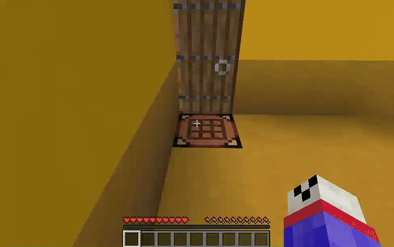

# Schneckenhaus Plugin

Ever wanted to know how a shulker box looks from the inside? 
Ever wanted to enter a chest?
Ever wanted to store your house in your inventory?
This plugin has you covered!


Every snail shell (an enterable block) can be customized using a graphical interface:
- Rename your snail shell
- Manage permissions (owners, enter permissions, build permissions, whitelists, blacklists)
- Keep track of where you placed down your snail shell
- Upgrade its size
- Change its color (for shulker boxes)
- Change its wood type (for chests)




If you can't decide what color to pick, no worries, just choose all of them!


If you aren't convinced yet, the plugin also features:

- Support for **completely custom shell types**!
  - Configure the template, item, spawn position, exit blocks, menu block, initial blocks and more
  - Simple **importing and exporting** to a custom file format.
  - Share and download your custom shell types on our Discord server.
- **Nested snail shells**: Enter a snail while already inside another one! (Recursion means that something is recursive)
- Finely grained **permissions**
- Enable **home shells** to automatically give every new player a new snail shell
  - Configure its type, color, size, etc. in the config
  - Prevent homelessness on your server and make home shells impossible to lose
- Custom, highly configurable **crafting recipes**
  - specify optional ingredients that increase the snail shell's size
  - specify an optional ingredient that enabled rainbow mode
  - support for items with custom model data
- Use hoppers to transfer items into shells and out of them. You can build whole factories inside a shell and connect them to the outside world!
- Your snail shell will stay loaded if you have it in your inventory or placed in a loaded chunk
- Support for **multiple worlds**, for example, one world where player-crafted shells are stored in, and one for command-created ones
- Powerful tab-completed syntax-highlighted commands
- **Ultra powerful shell management tools**:
  Ever wanted to delete all light blue shulker box shells of size 13 with whitelist enabled owned by some player crafted in the last week?
  Let's be honest: You always wanted to do exactly that. And this plugin makes it possible.
- Data is stored efficiently and securely in an **SQLITE database**
- ... and much more!

## Documentation

Table of contents:
1. [Commands](#command-system)
2. [Custom Shells](#custom-shells)
3. [Configuration](#configuration)
4. [Permissions](#permissions)

## Command System

### Shell Selectors

When a command requires you to specify one or multiple shells like `/sh tp shell <shell>` or `/sh info <shell>`,
you have multiple ways to do so:

- `here` resolves to the shell at your location, this is the default value for many commands
- `selection` resolves to all shells you selected, see [Selections](#selections)
- `<id>` resolves to the shell with the specified id

### Commands

- `sh`
  - `tp`
    - `shell <shell>` teleport to a shell
    - `world <world>` teleport to a world that contains snail shells
  - `info <shell>` displays a lot of information about a certain shell in the chat
  - `menu <shell>` opens a snail shell's menu
  - `item <shell>` gives you an item associated with the given shell
  - `count`
    - `total` displays the total number of snail shells on this server
    - `world <world>` displays the number of snail shells which are stored inside a world
  - `delete <shell>` deletes a shell, cannot be undone
  - `create <type>` type can be `shulker`, `chest`, `head` or `custom`; depending on the type, you specify one or more of these options:
    - `owner <owner>`
    - `world <world>` world in which the snail shell will be stored
    - `permission`
      - `enter <enterPermissionMode>`
      - `build <buildPermissionMode>`
    - `size <size>` only for shulker and chest shells, will be random in unspecified
    - `color <color>` only for shulker shells, will be random if unspecified
    - `rainbow <rainbow>` only for shulker shells, false by default
    - `head-owner <headOwner>` only for head shells, will be the creator by default
    - `template <template>` only for custom shells, **required to create custom shells**
    - `position` specify at which position in the grid the shell will be generated, has some quirks
      - `id <id>` id of the position
      - `grid <x> <z>` coordinates of the position
      - `here` position at your current location
  - `home`
    - `tp` teleports to your own home shell
    - `tp <player>` teleport to someone else's home shell
    - `set <player> <home>`
    - `unset <player>`
  - `language <language>` changes the plugin's language
  - `discord` shows the link to join our discord server
  - `tag <shell>`
    - `list`
    - `add <tag>`
    - `remove <tag>`
    - `clear`

### Selections

Selections is a powerful feature, which enables you to search for snail shells using a variety of criteria. Besides,
selections make it possible to run other commands on all shells that are selected.
Every player and the server console has a current selection, which is empty be default.

- `sh`
  - `selection`
    - `clear` deletes your current selection
    - `list` lists the ids of currently selected snail shells
  - `select` this command takes one or more criteria that must all be true:
    - `id <id>` you also specify a range like `7..` or `7..42` 
    - `world <world>` the world where the shell is stored
    - `position <position>` the id of the shell's position, can also be a range
    - `type <type>` the type of the shell, like `shulker`, `chest`, `head` or `custom`
    - `creation`
      - `reason <creationType>` can be `crafting`, `command` or `home`
      - `time` timestamps must be specified like this: '2025-08-21 21:01:42'
        - `after <creationTimeMin>`
        - `before <creationTimeMax>`
        - `between <creationTimeMin> and <creationTimeMax>`
    - `creator <creator>` can be an uuid, name or player selector
    - `name <name>` name of the shell
    - `permission` permission modes can be `whitelist`, `blacklist`, `everybody`, `nobody`
      - `enter <enterPermissionMode>`
      - `build <buildPermissionMode>`
    - `size <size>` size of chest and shulker shells, can also be a range like `4..8`
    - `color <color>` color of shulker shells
    - `rainbow <rainbow>` a boolean that indicates whether rainbow mode is enabled for a shulker shell
    - `wood <wood>` the wood type of a chest shell like `oak`
    - `template <template>` the template name of a custom shell
    - `head <head>` the head owner of a head shell
    - `tag <tag>` selects shells that have a certain tag
    - `owner <owner>`
    - `sort by <sortCriterion> <sortOrder>`
      - the sort criterion can be `id`, `position`, `size` or `creation_date`
      - the sort order can be `ascending` or `descending`
    - `limit <limit>` only includes the first `<limit>` results in the selection
    - `offset <offset>`
    - `combine <combine>` specifies how the old and new selection should be merged
      - `replace` (default) means to replace the old selection with the new one
      - `append` means to append the new to the old (excluding duplicates)
      - `remove` keep the old selection except for the shells that are in the new selection
      - `intersect` keep only shells in both the new and old selection

## Custom Shells

### Creating Custom Shells

You first have to build a template for your custom shell type. 
When the custom shell type is instantiated, e.g. through crafting, a copy of the template is created in the snail shell world.

The template can be built in any world, but it is advisable to build it in the snail shell world.
To do that, execute `/sh tp world schneckenhaus` to be teleported to the default snail shell world.
You must build your template at a position where every block of the template has either a negative x or z coordinate.
Otherwise, there could be conflicts between shells created by the plugin and your template.

When you are finished building, run `/sh custom add <name> <world> <position1> <position2> <item> <ingredient>`.
`name` can be freely chosen by you and is used to identify your custom shell type.
Renaming your custom shell type afterward is not possible.
`world` is the world where you built the template, for example `schneckenhaus`.
`position1` and `position2` are the corner positions of your template.
Look at these corner blocks and use tab completion to make your life easier.
`item` is the item/block that will represent an instance of your custom shell.
`ingredient` is an ingredient used to craft your custom shell type.
You can later edit and add ingredients in the config file.

Using the command `/sh custom edit <name> ...` you can set some other properties of your custom shell type.
You could also change this is the config file.

#### Spawn Point

`/sh custom edit <name> set-spawn`

Configure where the player spawns in the snail shell and in which direction he will look.

#### Initial Blocks

`/sh custom edit <name> add-initial-block <position>`

`/sh custom edit <name> add-initial-block-area <position1> <position2>`

If you want a block to be copied, but you want the player to be able to break it and replace it afterward, configure the block as an initial one.

#### Menu Block

`/sh custom edit <name> set-menu-block <position>`

Clicking this block will open the snail shell menu. 

#### Exit Blocks

`/sh custom edit <name> add-exit-block <position>`

Clicking one of these blocks will make the player leave the shell.

#### Block Restrictions

`/sh custom edit <name> set-block-restrictions <position> [<restriction1>] [<restriction2>] [<restriction3>]`

`/sh custom edit <name> set-block-area-restrictions <position1> <position2> [<restriction1>] [<restriction2>] [<restriction3>]`

`/sh custom edit <name> clear-block-restrictions <position1>`

For every block in your snail shell, there is a list of block types, which is called "block restrictions".

If this list is empty for a block, it means that there are no restrictions, 
and that the player can break the block and place another block at this position.
Actually adding a block as an initial block (using `/sh custom <name> edit add-initial-block`), will under the hood
set the block restrictions list for that block to be empty.

If the restriction list of a block is not empty, that block's type must be contained in the list.

Players won't be able to place/break blocks if this invariant is not fulfilled after that.
Besides, the repair system also enforces this.

If you don't explicitly specify the restriction list for a block, the list's default value depends on whether the block is an air or non-air one.
If it is an air block, the restriction list defaults to an empty list, meaning that players can place anything they want at that block position.
If it is a non-air block, the restriction list defaults to a list only containing the block type of that non-air block.
This means that players can't break any blocks that are part of the template by default.

The default values can also be changed by using `/sh custom edit <name> set-protect-air true`.
If the `protect_air` property is set to true, the restriction list of an air block in the template will default to a list
containing only air. Therefore, players can't place blocks in the custom shell unless they are explicitly allowed to do so
at a certain location.

### Exporting Custom Shell Types

Run `/sh custom export <name>`. Copy the file created in the `plugins/Schneckenhaus/export` directory.
You can share your creations on our Discord server.

### Importing Custom Shell Types

Place the file to import in the `plugins/Schneckenhaus/import` directory.
Move to the world and position where you want the template to be placed.
It is recommended to place your template in the default snail shell world.
To do that, type `/sh tp world schneckenhaus` to be teleported to this world.
Now make sure that your x and z coordinate are both negative, and that you are far enough away from positive x or z coordinates (e. g. x = z = -100)
This is important because if you place the template too near to other shells (which always have positive x and z coordinates), the template's area
and the shell's area could overlap.
Now run `/sh custom import <filename> as <name>`
`name` will be the alias you use to refer to the newly imported shell type.
Custom shell types can't be renamed afterward.
After importing, you can use the crafting recipe (see config file) or `/sh create custom template <name>` to create instances of your custom shell type. 


## Configuration

### Shulker / Chest / Head Shell Configuration

```yaml
# This documentation applies to chest and head shells accordingly
shulker:
  # whether shulker shells can be crafted
  crafting: true
  # ingredients needed for crafting besides a (colored) shulker block
  ingredients:
    - item: 'minecraft:spyglass'
      amount: 1
      # model refers to the custom model data attached to an item (used to create custom items)
      model: null
      
  # the size if no size ingredient is used
  initial_size: 4
  # the maximum size that can be achieved through adding size ingredients
  max_size: 30
  # can be optionally added to the crafting recipe to increase the shell's size
  size_ingredient: { item: 'minecraft:gold_ingot', amount: 1, model: null }
  # how much the size will increase if one size ingredient is added
  size_per_ingredient: 2

  # the maximum size that can be achieved through upgrades
  max_upgrade_size: 30
  # used to upgrade the size in the snail shell menu
  upgrade_ingredient: { item: 'minecraft:gold_ingot', amount: 1, model: null }
  # how much the size increases per upgrade
  size_per_upgrade_ingredient: 2

  # number of ticks between color changes in rainbow mode
  # this is also limited by shell_instances_sync
  rainbow_delay: 60 
  # can be added to the crafting recipe to enable rainbow mode
  rainbow_ingredient: { item: 'minecraft:clock', amount: 1, model: null }
```

### Custom Shell Configuration

*NOTE*: While it is possible to add and edit custom shell types through the config file, it is way easier to do so
by using the commands [described here](#creating-custom-shells)

```yaml
custom:
  # name of your custom shell type, don't change this unless you know what you are doing
  portable-garden:
    item: minecraft:birch_wood # the item / block representing this shell type
    crafting: true
    # ingredients needed to craft this custom shell type
    ingredients:
    - {item: 'minecraft:birch_log', amount: 64, model: null}
    - {item: 'minecraft:birch_sapling', amount: 1, model: null}
    - {item: 'minecraft:bone_meal', amount: 16, model: null}
    - {item: 'minecraft:moss_block', amount: 32, model: null}
    - {item: 'minecraft:spyglass', amount: 1, model: null}
    template_world: schneckenhaus # name of the world where the template for this shell type is placed
    template_position: -30 0 -30 -20 10 -20 # area of the template
    protect_air: false # whether players can build anywhere inside the shell by default
    block_restrictions: # see the section about creating custom shells for a detailed explanation of what this means
      -25 1 -25: ['minecraft:cauldron', 'minecraft:lava_cauldron', 'water_cauldron']
    spawn_position: {x: -188.50940344422307, y: 122.9375, z: 219.30000001192093, yaw: -18.117798,
      pitch: 3.7506914}
    # clicking one of these blocks teleports you back
    exit_blocks: [-189 124 218, -189 123 218]
    # opens the snail shell menu
    menu_block: -188 123 218
```

### Home Shell Configuration

If home shells are enabled, players will automatically receive a new shell when they join the server
and don't already have a home belonging to them.
The player must have the permission `schneckenhaus.home_shell` (which is false by default).
If players additionally have the permission `schneckenhaus.never_homeless` (which is true by default),
it is impossible for them to lose their homes.
Because if they lose it, it will be given back to them on rejoin / respawn.

Examples:

```yaml
home_shell:
  type: shulker,
  size: 16,
  color: white
  enter_permission_mode: everybody # this can be specified regardless of shell type
  build_permission_mode: whitelist # but is not repeated for the following
```

```yaml
home_shell:
  type: chest
  size: 16
  wood: birch
```

```yaml
home_shell:
  type: head
```

```yaml
home_shell:
  type: custom
  template: your-template-name
```

### World Configuration

Example:

```yaml
worlds:
  # name of the world
  schneckenhaus:
    fallback: true # whether this is the default world for snail shell creation, can only be true for one world
    biome: 'plains' # biome of the void world, this value is only used when newly creating the world, not for already existing ones
    time_sync_world: world # will sync the time with another world
    conditions: []
  schneckenhaus_homes: # for example, a second world that should contain all home shells
    fallback: false
    time_sync_world: world
    conditions: # at least one of the following conditions must be true for a shell to be created in this world
      # example condition: all shells created by the home shell system will be created in this world
      type: creation
      creation_type: home
```

### Shell Conditions

Shell conditions are YAML objects that can be evaluated for shells that are being created or are already created.
Using these conditions, you can enable some features only for some shells.
There are multiple types of shell conditions.
If you have to specify a list of conditions, usually at least one has to be true.

Examples of the different condition types:

```yaml
type: shulker
size: {min: 5, max: 10} # optional
colors: green, red, white # optional
rainbow: false # optional
```

```yaml
type: chest
size: {min: 5, max: 10} # optional
wood: birch # optional
```

```yaml
type: head
```

```yaml
type: custom
template: your_template_name # optional
```

```yaml
type: creation
creator: 7370723c-1f89-4e7c-a9fe-30ba8b4f0ae3 # optional
creation_type: crafting # optional, can also be command or home
permission: some.permission # optional, permission which the creator must have, 
                            # can only be checked for online players
```

```yaml
type: tag
tag: some-tag-name
```

```yaml
type: not
condition:
  type: shulker
  size: {min: 10}
```

```yaml
type: and
conditions:
  - type: shulker
  - type: creation
    creation_type: crafting
```

### Miscellaneous Config Options

```yaml
# if enabled, the chunks of a snail shell stay loaded if it is in an online player's inventory or placed in a loaded chunk
chunk_loading:
  enabled: true
  conditions: []
  delay: 100
# if enabled, hoppers can be used to transfer items into snail shells and out of them
hoppers:
  enabled: true
  conditions: []
# this system handles animations (rainbow mode) and manual color changes
shell_instances_sync:
  enabled: true
  conditions: []
  delay: 20
  shells: true
  placed_shells: true
  placed_shells_range: 32
  items: true # animate items in inventory
  dropped_items: true # animate dropped items
  dropped_items_range: 16 # max range near a player
# if enabled, players can't break other players' snail shells
# there can be exceptions to this via permissions
theft_prevention:
  enabled: true
  conditions: []
# will prevent exploits like using pistons / ender pearls etc. to escape a shell
escape_prevention:
  enabled: true
  conditions: []
  delay: 20
# will revert even the most severe kinds of damages to snail shells (WorldEdit etc.)
repair_system:
  enabled: true
  conditions: []
  delay: 200
# players will be teleported here when leaving a shell, but no exit location is known
# set to null to use world spawn
fallback_exit_location:
  world: world
  x: 0
  y: 80
  z: 0
  yaw: 0
  pitch: 0
# don't change this
data_version: 3.0.0
```

## Permissions

- `schneckenhaus.craft_shell` (default: true)
- `schneckenhaus.place_shell` (default: true)
- `schneckenhaus.enter_shell` (default: true)
- `schneckenhaus.quickly_enter_shell` (default: false)
- `schneckenhaus.enter_nested_shells` (default: true)
- `schneckenhaus.ask_for_enter_permission` (default: true)
- `schneckenhaus.change_enter_permission` (default: true)
- `schneckenhaus.bypass_shell_enter_permission` (default: op)
- `schneckenhaus.change_build_permission` (default: true)
- `schneckenhaus.bypass_shell_build_permission` (default: op)
- `schneckenhaus.bypass_theft_prevention` (default: op)
- `schneckenhaus.home_shell` (default: false)
- `schneckenhaus.never_homeless` (default: true)
- `schneckenhaus.shell_in_ender_chest` (default: true)
- `schneckenhaus.open_own_snail_shell_menu` (default: true)
- `schneckenhaus.open_other_snail_shell_menus` (default: op)
- `schneckenhaus.create_snail_shell_copies` (default: op)
- `schneckenhaus.rename_snail_shell` (default: true)
- `schneckenhaus.edit_owners` (default: true)
- `schneckenhaus.change_snail_shell_color` (default: true)
- `schneckenhaus.toggle_rainbow_mode` (default: true)
- `schneckenhaus.upgrade_snail_shell_size` (default: true)
- `schneckenhaus.change_shell_wood` (default: true)
- `schneckenhaus.delete_shell` (default: op)
- `schneckenhaus.placements.view` (default: true)
- `schneckenhaus.placements.view_positions` (default: true)
- `schneckenhaus.placements.teleport` (default: op)
- `schneckenhaus.bypass_escape_prevention` (default: op)
- `schneckenhaus.command.select` (default: op)
- `schneckenhaus.command.list` (default: op)
- `schneckenhaus.command.create` (default: op)
- `schneckenhaus.command.info` (default: op)
- `schneckenhaus.command.tag` (default: op)
- `schneckenhaus.command.item` (default: op)
- `schneckenhaus.command.count` (default: op)
- `schneckenhaus.command.delete` (default: op)
- `schneckenhaus.command.tp` (default: op)
- `schneckenhaus.command.home.tp.own` (default: op)
- `schneckenhaus.command.home.tp.others` (default: op)
- `schneckenhaus.command.home.manage` (default: op)
- `schneckenhaus.command.discord` (default: op)
- `schneckenhaus.command.menu` (default: op)
- `schneckenhaus.command.language` (default: op)
- `schneckenhaus.command.custom` (default: op)
- `schneckenhaus.command.debug` (default: false)